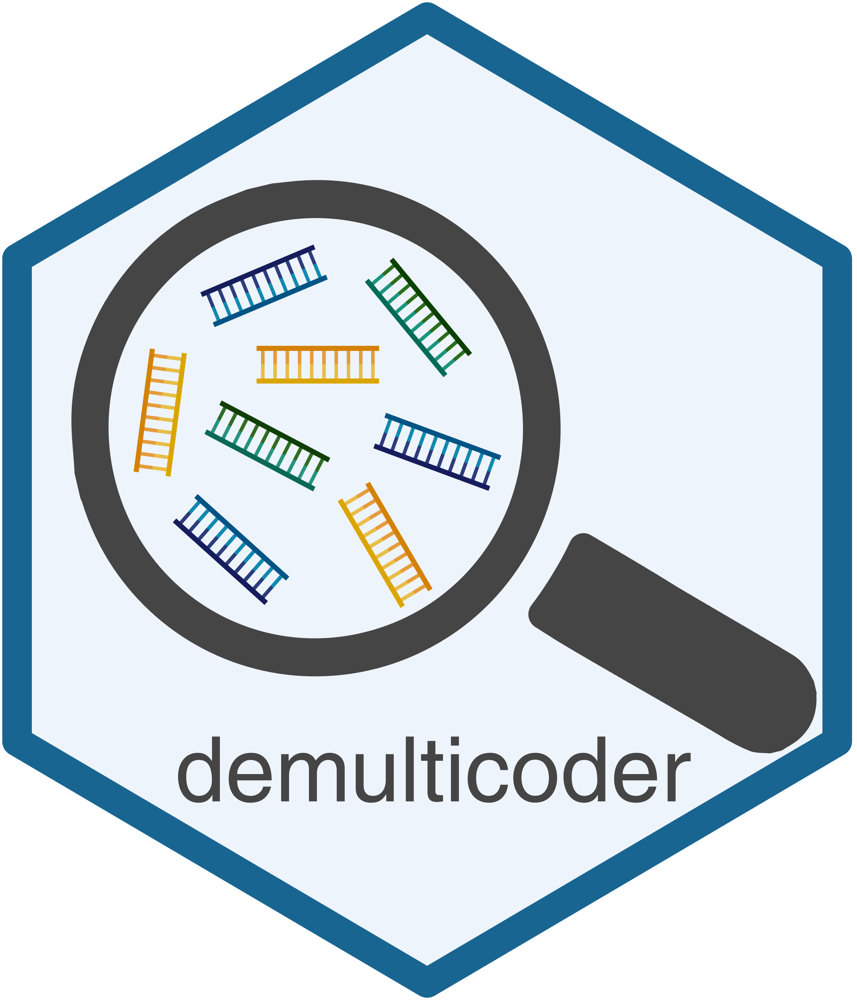
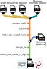

```{r, include = FALSE}
knitr::opts_chunk$set(
  collapse = TRUE,
  comment = "#>",
  out.width = "100%"
)
```

  

## **demulticoder**: An R package for the simultaneous analysis of multiplexed metabarcodes

### Introduction

The ***demulticoder*** package is a cutadapt and DADA2 wrapper package for metabarcodng analyses. The main commands and outputs are intuitive and comprehensive, which helps to account for the complex and iterative nature of metabarcoding analyses. 

Here is a brief schematic of the general workflow:  

```{r workflow-diagram, echo=FALSE, out.width="35%", out.height="35%", fig.align="left"}

```

### Key Features

* It automates the use of DADA2 to analyze data derived from multiple metabarcodes.  
* It reduces the number of manual input steps  
* Handles analysis of two metabarcodes multiplexed into the same sequencing batch    
* Analyze different types of metabarcodes simultaneously  
* Reproducible workflows for oomycetes
* Supported metabarcodes: 16S rDNA, ITS1, *rps10*, and up to two additional metabarcodes 

### Installation  

To install the development version of package: 

```{r, eval=FALSE, echo=TRUE}
devtools::install_github("grunwaldlab/demulticoder")
```

### Quick start  

**1. Set-up input directory and files**  

After installing the package, make a **data directory**.  

Within this directory you'll need:

* **PE short read amplicon data**
  * The files must end in either '_R1.fastq.gz' , or '_R2.fastq.gz' and each sample must have both R1 and R2 files.
* [**metadata.csv**](https://github.com/grunwaldlab/demulticoder/blob/main/inst/extdata/metadata.csv)
  * New row for each unique sample
  * Samples entered twice if samples contain two pooled metabarcodes, as in the example template
* [**primerinfo_params.csv**](https://github.com/grunwaldlab/demulticoder/blob/main/inst/extdata/primerinfo_params.csv)
  * New row for each unique barcode and associated primer sequence
  * Optional cutadapt and DADA2 parameters
  * See [**Documentation**](https://grunwaldlab.github.io/demulticoder/articles/Documentation.html) for more information
* **Taxonomy databases**  
  * UNITE fungal database
  * Silva 16S rDNA
  * oomyceteDB 
  * Up two custom databases
    * See [**Documentation**](https://grunwaldlab.github.io/demulticoder/articles/Documentation.html) for how to format. 
  
  
**2. Prepare reads** 
```{r, eval=FALSE, echo=TRUE}
output<-prepare_reads(
  data_directory = "<DATADIR>",
  output_directory = "<OUTDIR>")
```


**3. Cut and trim reads** 
```{r, eval=FALSE, echo=TRUE}
cut_trim(
  output,
  cutadapt_path="<CUTADAPTPATH>")
```
  
  
**4. Make ASV abundance matrix** 
```{r, eval=FALSE, echo=TRUE}
make_asv_abund_matrix(
  output)
```
  
  
**5. Assign taxonomy** 
```{r, eval=FALSE, echo=TRUE}
assign_tax(
  output,
  asv_abund_matrix)
```

  
**6. Convert ASV matrix to taxmap and phyloseq objects** 
```{r, eval=FALSE, echo=TRUE}
objs<-convert_asv_matrix_to_objs(output)
```

### Check out the website to view the documentation and see more examples  
For more information on source code, check out the package repository: 
https://grunwaldlab.github.io/demulticoder/

### For source code: 
https://github.com/grunwaldlab/demulticoder/

### Citation

The package was developed by Martha Sudermann, Zachary Foster, Samantha Dawson, Hung Phan, Jeff Chang, and Niklaus Grünwald

An associated manuscript is currently under review. 