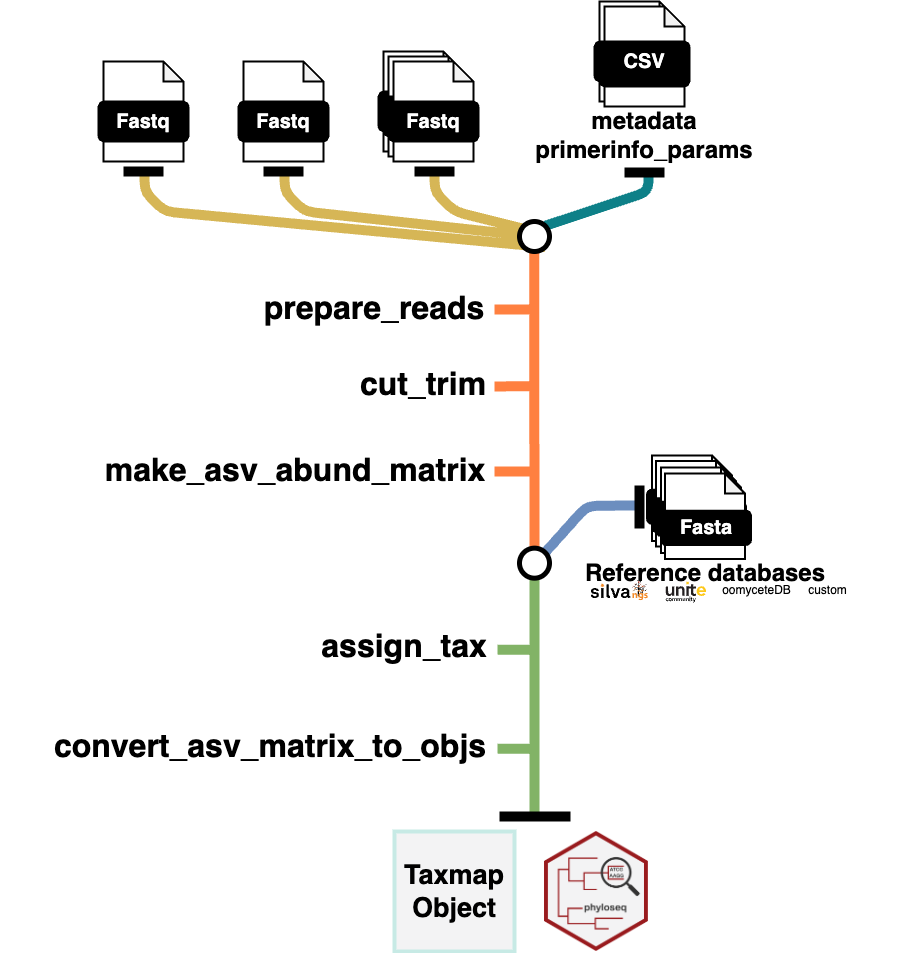

# Demulticoder R package

**This package is actively under development. Until this message has
been removed, use with caution. Additional testing, documentation, and
examples are in progress.**

### Introduction

The ***demulticoder*** package is a Cutadapt and DADA2 wrapper package
for metabarcodng analyses. The main commands and outputs are intuitive
and comprehensive, which helps to account for the complex and iterative
nature of metabarcoding analyses.

Here is a brief schematic of the general workflow:



### Key features

- The ability to do analysis on either demultiplexed or pooled amplicons
  within samples  
- Amplicons from multiple datasets be trimmed of primers, filtered,
  denoised, merged, and given taxonomic assignments in one go (with
  different parameters for each dataset if desired)  
- The package handles not just 16S or ITS datasets when using default
  UNITE fungal or Silva 16S databases but also oomycete rps10 analyses
  using oomycetedb (<https://oomycetedb.org>), or up to two custom
  databases (provided they are formatted as described here:
  <https://benjjneb.github.io/dada2/training.html>).

### Installation

To install the development version of package:

``` r
devtools::install_github("grunwaldlab/demulticoder")
```

### Check out the website to see how to use the package

For more information, key functions, inputs, and example vignettes,
check out the documentation at:
<https://grunwaldlab.github.io/demulticoder>

### Citation

Manuscript pending. Stay tuned

The package was developed by Martha Sudermann, Zachary Foster, Samantha
Dawson, Hung Phan, Niklaus Grnwald, Jeff Chang.
