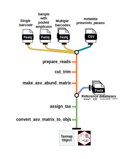

```{r, include = FALSE}
knitr::opts_chunk$set(
  collapse = TRUE,
  comment = "#>",
  fig.path = "man/figures",
  out.width = "100%"
)
```

# Demulticoder R package

**This package is actively under development. Until this message has been removed, use with caution. Additional testing, documentation, and examples are in progress.**

### Introduction

The ***demulticoder*** package is a Cutadapt and DADA2 wrapper package for metabarcodng analyses. The main commands and outputs are intuitive and comprehensive, which helps to account for the complex and iterative nature of metabarcoding analyses. 

Here is a brief schematic of the general workflow:

```{r workflow-diagram, echo=FALSE, out.width="80%", out.height="400px", fig.align="center"}

```

### Key features
- The ability to do analysis on either demultiplexed or pooled amplicons within samples  

- Amplicons from multiple datasets be trimmed of primers, filtered, denoised, merged, and given taxonomic assignments in one go (with different parameters for each dataset if desired)  

- The package handles not just 16S or ITS datasets when using default UNITE fungal or Silva 16S databases but also oomycete rps10 analyses using oomycetedb (https://oomycetedb.org), or up to two custom databases (provided they are formatted as described here: https://benjjneb.github.io/dada2/training.html).

### Installation

To install the development version of package: 

```{r, eval=FALSE, echo=TRUE}
devtools::install_github("grunwaldlab/demulticoder")
```

### Quick start

**1. Set-up input directory and files**  

After installing the package, make a data directory and add the following files:  
  -  PE short read amplicon data. The files must end in either *_R1.fastq.gz* , or *_R2.fastq.gz* and each sample must have both R1 and R2 files.
  
  -  [**metadata.csv**](https://github.com/grunwaldlab/demulticoder/blob/main/inst/extdata/metadata.csv) file (there will be a unique row for each sample, and samples will be entered twice if they contain pooled amplicions, as in the example template)  
  
  -  [**primerinfo_params.csv**](https://github.com/grunwaldlab/demulticoder/blob/main/inst/extdata/primerinfo_params.csv) file (there will be a new row for each unique barcode and associated primer sequences, and there are also optional Cutadapt, DADA2 or filtering parameters that can be added or adjusted)

**2. Prepare reads** 
```{r, eval=FALSE, echo=TRUE}
output<-prepare_reads(
  data_directory = "<DATADIR>",
  output_directory = "<OUTDIR>")
```

**3. Cut and trim reads** 
```{r, eval=FALSE, echo=TRUE}
cut_trim(
  output,
  cutadapt_path="<CUTADAPTPATH>")
```

**4. Make ASV abundance matrix** 
```{r, eval=FALSE, echo=TRUE}
make_asv_abund_matrix(
  output)
```

**5. Assign taxonomy** 
```{r, eval=FALSE, echo=TRUE}
assign_tax(
  output,
  asv_abund_matrix)
```

**6. Convert ASV matrix to taxmap and phyloseq objects** 
```{r, eval=FALSE, echo=TRUE}
objs<-convert_asv_matrix_to_objs(output)
```

### Check out the website to view the documentation and see more examples 

For more information, key functions, inputs, and example vignettes, check out the documentation at: https://grunwaldlab.github.io/demulticoder

### Citation

The package was developed by Martha Sudermann, Zachary Foster, Samantha Dawson, Hung Phan, Niklaus Grnwald, Jeff Chang.

Stay tuned for associated manuscript. 