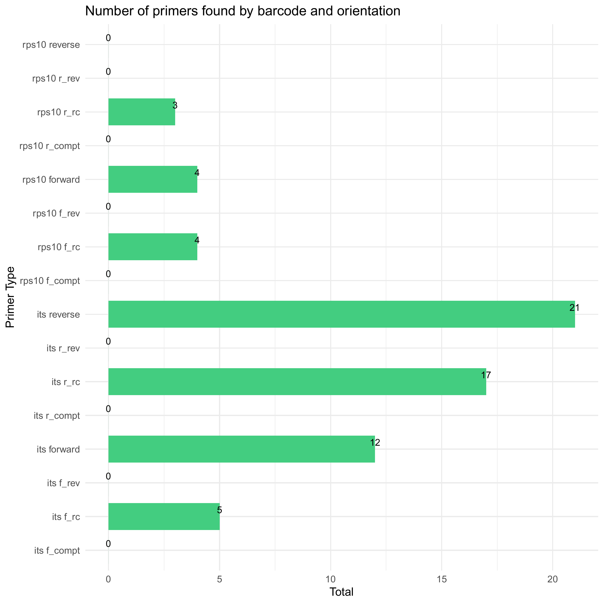
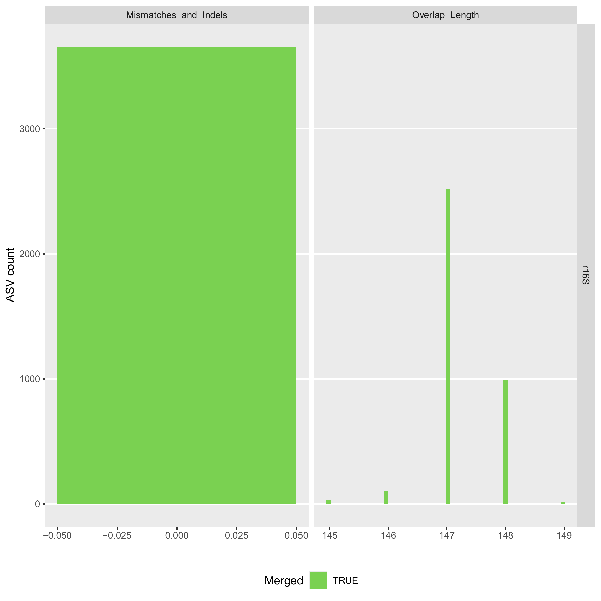
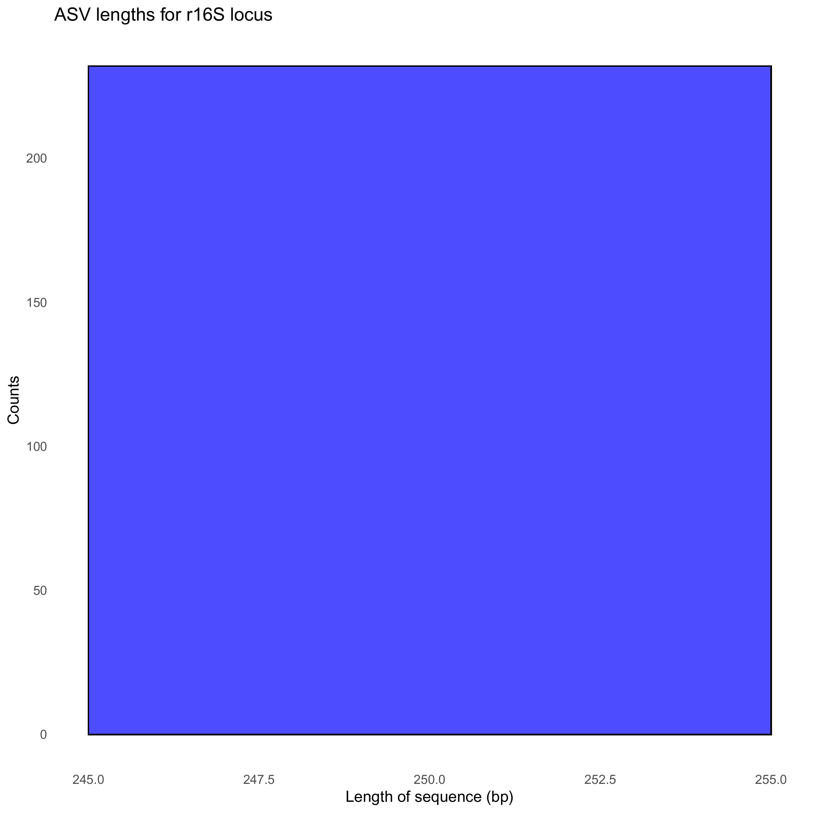

```{r, include = FALSE}
knitr::opts_chunk$set(
  collapse = TRUE,
  comment = "#>",
  fig.path = "./",
  out.width = "70%",
  fig.retina = 1
)


```


## This vignette shows how demulticoder can be used when you have pooled rps10 and ITS1 amplicons within each sample.  

This is example shows how an analysis is done with the full rhododendron dataset showcased in the [Getting Started](https://grunwaldlab.github.io/demulticoder/articles/Getting_started.html) vignette. Reads and databases are not sub-sampled as they were for that test dataset.  

```{r overwrite_existing_or_ont, include=FALSE, echo=FALSE}
library(dplyr)
library(kableExtra)
overwrite_existing <- FALSE
```

### Prepare input files
First, make sure input metadata and primerinfo_params files are in data folder  

The only required columns are the first with sample names, and the second with the primer name/barcode used. The subsequent columns are user-specific columns for downstream steps  

***metadata.csv* file**
```{r, echo=FALSE}
data <- data.frame(
  sample_name = c("S1", "S1", "S10", "S10", "S100", "S100"),
  primer_name = c("rps10", "its", "rps10", "its", "rps10", "its"),
  plate = c(1, 1, 1, 1, 2, 2),
  well = c("A01", "A01", "B02", "B02", "B02", "B02"), 
  organism = c("Cry", "Cry", "Cry", "Cry", "Cin", "Cin"),
  flooded = c(TRUE, TRUE, TRUE, TRUE, TRUE, TRUE),
  path_conc = c(100, 100, 1, 1, 1, 1), 
  experiment = c(1, 1, 1, 1, 2, 2),
  sample_type = c("Sample", "Sample", "Sample", "Sample", "Sample", "Sample"), 
  is_ambiguous = c(FALSE, FALSE, FALSE, FALSE, FALSE, FALSE)
)

knitr::kable(data, row.names = FALSE) %>%
  kable_styling(bootstrap_options = c("striped", "hover", "condensed", full_width = F, font_size = 6))
```

*For the purposes of this example, I will just show the first few rows of metadata.csv* file

I then included the necessary second file with the name of the barcode selected, primer sequences, and the optional DADA2 parameter options. I referenced the DADA2 [tutorial](https://benjjneb.github.io/dada2/tutorial.html) to select the proper parameter options.

*primerinfo_params.csv*
```{r primer_info, echo=FALSE}
primer_info <- data.frame(
  primer_name = c("rps10", "its"),
  forward = c("CTTGGTCATTTAGAGGAAGTAA", "GTTGGTTAGAGYARAAGACT"), 
  reverse = c("GCTGCGTTCTTCATCGATGC", "ATRYYTAGAAAGAYTYGAACT"),
  already_trimmed = c(FALSE, FALSE), 
  minCutadaptlength = c(0, 0),
  multithread = c(TRUE, TRUE), 
  verbose = c(TRUE, TRUE), 
  maxN = c(0, 0), 
  maxEE_forward = c(5, 5),
  maxEE_reverse = c(5, 5),
  truncLen_forward = c(0, 0),
  truncLen_reverse = c(0, 0),
  truncQ = c(5, 5), 
  minLen = c(150, 50),
  maxLen = c(Inf, Inf), 
  minQ = c(0, 0), 
  trimLeft = c(0, 0),
  trimRight = c(0, 0),
  rm.lowcomplex = c(0, 0), 
  minOverlap = c(15, 15), 
  maxMismatch = c(2, 2),
  min_asv_length = c(50, 50)
)

# Use knitr::kable() to create the table with styling and scrolling
kable(primer_info, row.names = FALSE) %>%
  kable_styling(bootstrap_options = c("striped", "hover", "condensed", "responsive"), full_width = F, font_size = 12) %>%
  scroll_box(width = "100%", height = "100px", extra_css = "thead th { white-space: nowrap; }")
```

### Loading the Package  

For now, the package will be loaded by retrieving it from GitHub. 
We are submitting package to CRAN
```{r setup, echo=TRUE, results='hide', message=FALSE, warning=FALSE}
devtools::install_github("grunwaldlab/demulticoder", force=TRUE)
#devtools::load_all("~/demulticoder")
library("demulticoder")
```


### Step 1  
Remove N's and create directory structure for downstream steps
```{r prepare_reads, fig.height=6, fig.width=6, echo=TRUE, results='hide', message=FALSE, warning=FALSE}
outputs <- prepare_reads(
  data_directory = "~/benchmark_demulticoder/demulticoder/data", 
  output_directory = "~/benchmark_demulticoder/demulticoder/vignette_outputs",
  tempdir_path = "~/benchmark_demulticoder/demulticoder/vignette_temp",
  tempdir_id = "temp_files")
```

### Step 2  
Run Cutadapt to remove primers and then trim reads with DADA2 filterAndTrim function 
```{r Remove_primers_and_trim_reads, fig.height=6, fig.width=6, echo=TRUE, results='hide', message=FALSE, warning=FALSE}
cut_trim(
  outputs,
  cutadapt_path="/usr/bin/cutadapt")
```

We can now visualize the outputs from the primer removal and trimming steps. A CSV files is output showing which samples still have primer sequences and the barplot below summarizes the outputs. 

There are circumstances where a few primer sequences may still remain. If so, any ASVs with any residual primer sequences will be filtered at the end.  

```{r visualize_outputs_cut_trim, echo=FALSE, fig.height=6, fig.width=6}
if (!overwrite_existing) {
  
}
```

### Step 3  
Core ASV inference step
```{r ASV_inference, fig.height=6, fig.width=6, echo=TRUE, results='hide', message=FALSE, warning=FALSE}
make_asv_abund_matrix(
  outputs,
  overwrite_existing = FALSE)
```

We can now visualize the outputs from the ASV inference step.  

The first plot shows the how reads were merged in terms of mismatches and indels. 

The plot to the right shows the overlap lengths across the inferred ASVs.  

```{r visualize_outputs_asv_inf1, fig.height=10, fig.width=10, echo=FALSE}
if (!overwrite_existing) {
  
}
```

We can also look at the distribution of ASV lengths  

```{r visualize_outputs_asv_inf2, fig.height=10, fig.width=10, echo=FALSE}
if (!overwrite_existing) {
  
}
```

### Step 4  
Assign taxonomy step  
```{r assign_taxonomy_step, fig.height=6, fig.width=6, echo=TRUE, results='hide', message=FALSE, warning=FALSE}
assign_tax(
  outputs,
  asv_abund_matrix,
  db_its = "sh_general_release_dynamic_18.07.2023.fasta",
  db_rps10 = "oomycetedb_release2.fasta",
  retrieve_files=TRUE)
```

As a check we can take a look at read counts across the workflow. If there are sudden drops, we should reconsider our adjusting certain DADA2 parameters and re-running the analysis.  

```{r view_read_counts, fig.height=10, fig.width=10, echo=FALSE}
if (!overwrite_existing) {
  cat("Tables showing read counts throughout the demulticoder DADA2 workflow\n")
 track_path <- "./track_reads_r16S.csv"
   read_track_file<-read.csv(track_path)
   print(read_track_file)
}
```

### Step 5  
Convert asv matrix to taxmap and phyloseq objects with one function  

```{r convert_matrix_to_other_formats, fig.height=6, fig.width=6, warning=FALSE}
objs<-convert_asv_matrix_to_objs(outputs)
```

### Step 6-let's make some quick visuals (heat trees) to take a look at outputs of the analyses   

At this point the rps10 and ITS1 analyses are separate. Given the greater complexity of this dataset, more robust analyses are detailed in the associated package manuscript and the analyses code is also linked.  

First we make a heat tree for our ITS-barcoded samples 
```{r Heatree_demonstration_its, message=FALSE}
min_bootstrap <- 80

objs$taxmap_its$data$score$boot <- as.numeric(objs$taxmap_its$data$score$boot)
max_boot <- objs$taxmap_its$data$score %>%
  dplyr::group_by(taxon_id) %>%
  dplyr::summarise(max = max(boot))
max_boot <- setNames(max_boot$max, max_boot$taxon_id)
obj_subset_its <- filter_taxa(objs$taxmap_its, max_boot[taxon_ids] >= min_bootstrap | taxon_ranks %in% c("ASV", "Reference"), reassign_obs = c(abund = TRUE, score = FALSE))

obj_subset_its %>%
  filter_taxa(! is_stem) %>%
  filter_taxa(! grepl(x = taxon_names, "_sp$"), reassign_obs = FALSE) %>%
  filter_taxa(! grepl(x = taxon_names, "incertae_sedis", ignore.case = TRUE), reassign_obs = FALSE) %>%
  filter_taxa(! grepl(x = taxon_names, "NA", ignore.case = TRUE), reassign_obs = FALSE) %>%
  metacoder::heat_tree(node_label = taxon_names,
                       node_size = n_obs,
                       node_color = n_obs,
                       node_color_axis_label = "ASV count",
                       node_size_axis_label = "Total Abundance of Taxa",
                       layout = "da", initial_layout = "re")
```

Now we make a heat tree for our rps10-barcoded samples
```{r Heatree_demonstration_rps10, message=FALSE}
min_bootstrap <- 80

objs$taxmap_rps10$data$score$boot <- as.numeric(objs$taxmap_rps10$data$score$boot)
max_boot <- objs$taxmap_rps10$data$score %>%
  dplyr::group_by(taxon_id) %>%
  dplyr::summarise(max = max(boot))
max_boot <- setNames(max_boot$max, max_boot$taxon_id)
obj_subset_rps10 <- filter_taxa(objs$taxmap_rps10, max_boot[taxon_ids] >= min_bootstrap | taxon_ranks %in% c("ASV", "Reference"), reassign_obs = c(abund = TRUE, score = FALSE))

obj_subset_rps10 %>%
  filter_taxa(! grepl(x = taxon_names, "_sp$"), reassign_obs = FALSE) %>%
  filter_taxa(! grepl(x = taxon_names, "incertae_sedis", ignore.case = TRUE), reassign_obs = FALSE) %>%
  filter_taxa(! grepl(x = taxon_names, "NA", ignore.case = TRUE), reassign_obs = FALSE) %>%
  metacoder::heat_tree(node_label = taxon_names,
                       node_size = n_obs,
                       node_color = n_obs,
                       node_color_axis_label = "ASV count",
                       node_size_axis_label = "Total Abundance of Taxa",
                       layout = "da", initial_layout = "re")
```
